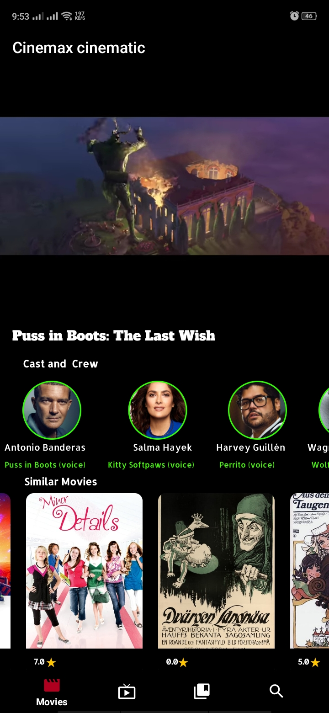

# CINEMAX MOVIE APP
Android application utilizing the Kotlin programming language. This application seamlessly integrates with the renowned  [TMDb API](https://developers.themoviedb.org/3/getting-started/introduction) , which allows users to explore and discover a 
wide range of popular, top-rated, and upcoming movies and TV shows. Furthermore, users can access trailers associated with 
the selected movies and TV shows, enhancing their overall viewing experience.

## Table Of Content

- [CINEMAX PHOTOS](#cinemax-photos)
    - [Table Of Content](#table-of-content)
    - [Prerequisite](#prerequisite)
    - [Architecture](#architecture)
    - [Tech Stack](#tech-stack)
        - [Libraries](#libraries)
    - [Screenshots](#screenshots)

## Prerequisite

To run the app from Android Studio on your local machine you'll need to add `api_key` value in your `local.properties` file

The API key can be generated from this [link](https://www.themoviedb.org/settings/api).

## Architecture

The app is built on MVVM architecture

## Tech Stack

### Libraries

__UI__

- [Hilt](https://dagger.dev/hilt/) - Dependency Injection framework
- [Coil](https://coil-kt.github.io/coil/) - Load images from network source.
- [Jetpack Navigation](https://developer.android.com/guide/navigation) - Navigations from one fragment to another.

__Data__

- [KTOR Client](https://ktor.io/docs/create-client.html)
- [KotlinX Serialization](https://github.com/Kotlin/kotlinx.serialization) - Serialization/Desirialization of JSON response from network.
- [Paging 3](https://developer.android.com/topic/libraries/architecture/paging/v3-overview) - Paging data fetched from network source.

## Screenshots

  
  
  
  
  

